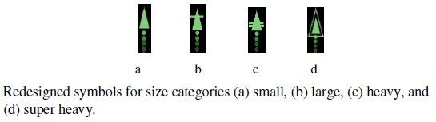

# ADSB Radarscope

ADSB Radarscope is a self-contained, browser-based ADS-B virtual radar display. It fetches aircraft data from a `tar1090` or `dump1090-fa` instance and renders it on a classic, round radar scope. It requires no server-side backend, libraries, or complex setup—just a web browser and a source for aircraft data.

> [!IMPORTANT]
> v1.0.0 release pending.

## Known Issues
Please post bug reports in the Discussions or send them to `adsbscope@dustsignal.dev`

### v1.0.0

No issues reported

### v0.9.2 through 0.1.1
- [x] ~~Does not work with some versions of dump1090-fa, investigating.~~
- [x] ~~Scope is distorted when adjusting side panels~~
- [x] ~~Aircraft are not highlighed on the scope when clicking on them in the left side panel~~
- [x] ~~Aircraft tracks become distorted when resizing the window~~
- [x] ~~Aircraft tracks become distorted when changing the range~~
- [x] ~~Aircraft tracks become distorted when resizing the side panels~~

## Future Enhancements

- [ ] Aircraft labels never overlap
- [ ] Aricraft labels never cover the trail
- [ ] Grabing the lat/lon from your feeder instead of the config setting
- [ ] Change the heading indicator line to an arrow (currently investigating best apporach through FAA icongraphc documentation)
- [x] Set minimum width for side panels
- [x] Add heading and sqawk code to aircraft info in the scope
- [x] Add airport markers and information to the scope view
- [ ] Add weather radar to the scope view
- [ ] Add FAA incongraphic symbols to aircraft. Sourced from FAA icongraphc documentation documents.

      

## License

This project is licensed under the GNU General Public License v3.0.

Copyright © 2025 dustsignal - dustsignal.dev
