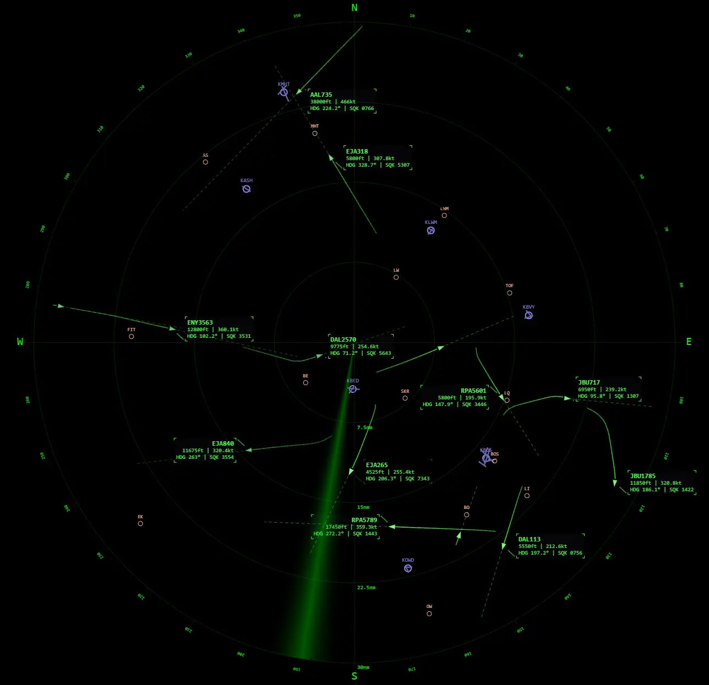
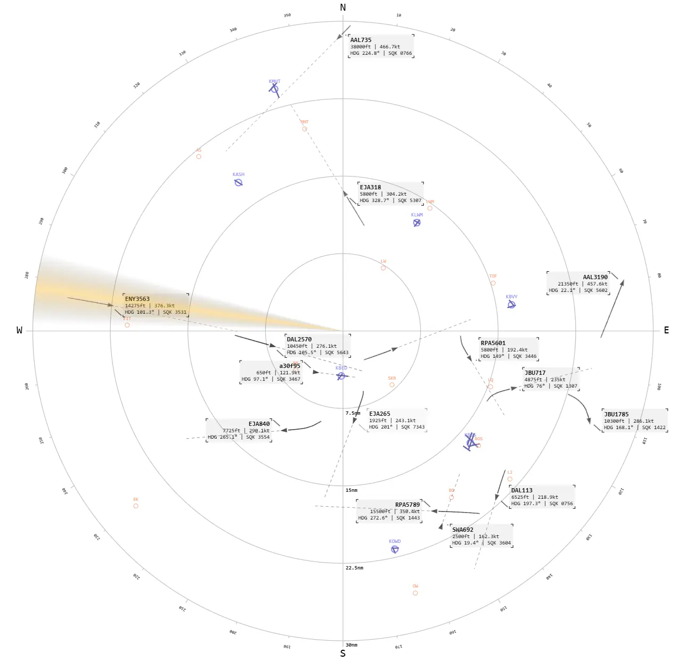
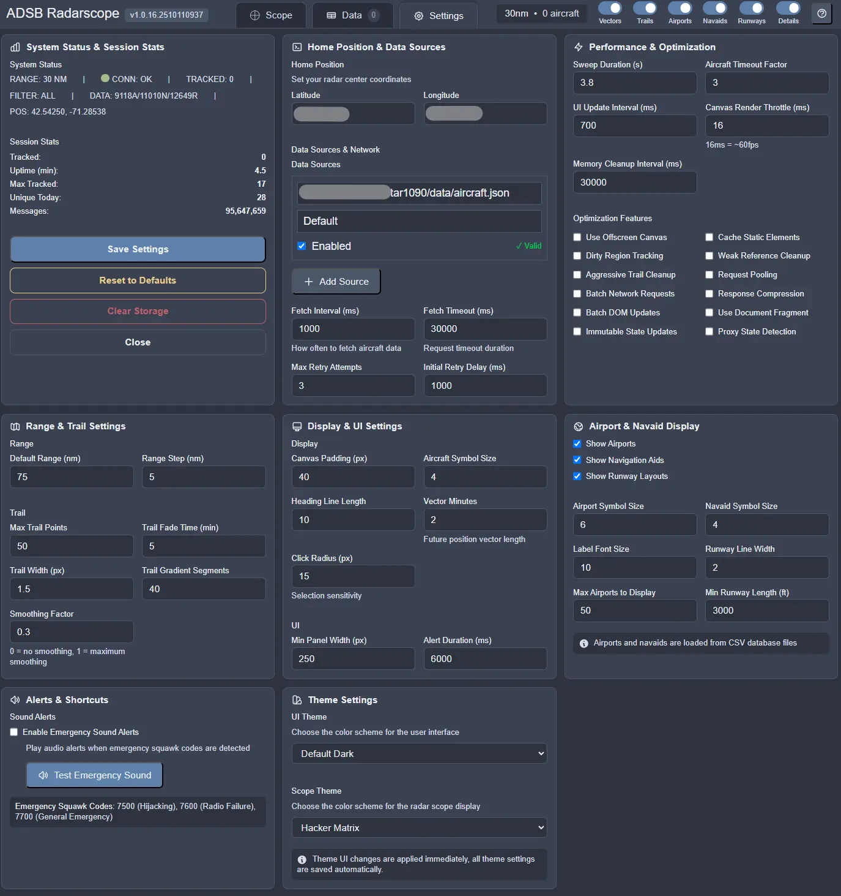
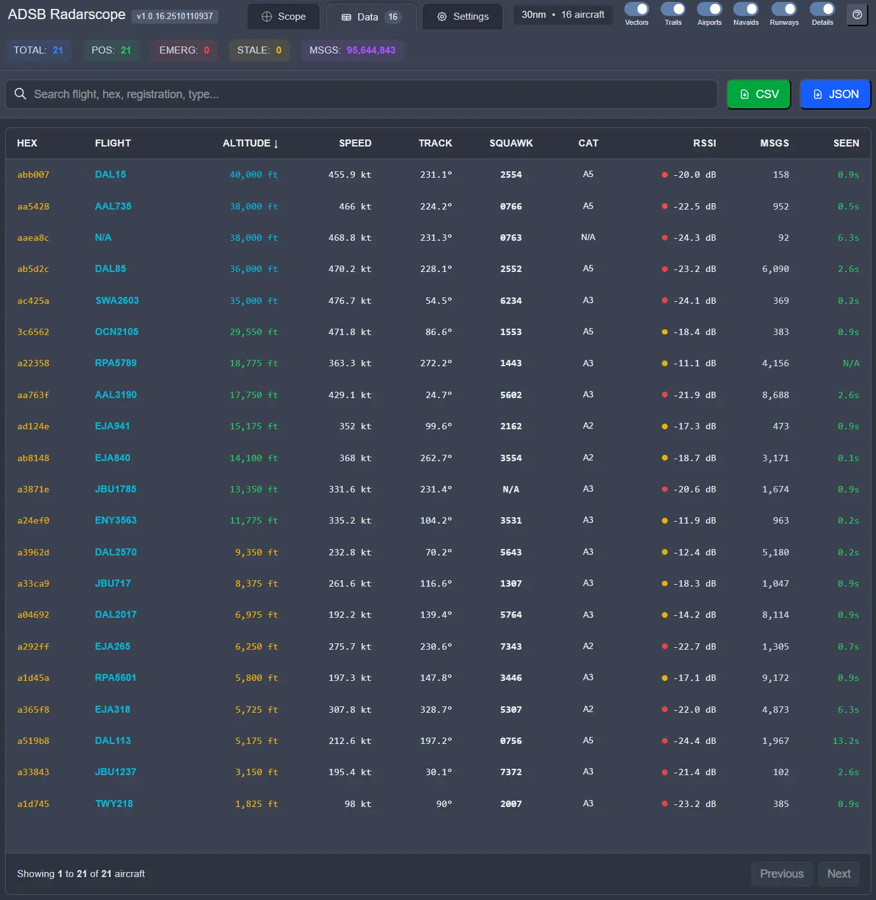

# ADSB Radarscope v1.0.16

A real-time web-based aircraft tracking application that visualizes ADS-B (Automatic Dependent Surveillance-Broadcast) data on a radar-like display.

<p align="center">
  
  
</p>
<p align="center">
  
  
</p>


## Features

### Real-Time Aircraft Tracking
- Live aircraft position updates from tar1090, FlightAware PiAware, or compatible data sources
- Rotating radar sweep effect with customizable themes
- Aircraft trails with gradient fading
- Vector prediction showing future positions
- Clickable aircraft for detailed information

### Advanced Visualization
- **60+ Scope Themes**: Classic CRT green, amber, military, aviation-inspired, and more
- **35+ UI Themes**: Dark and light color schemes
- **Airport & Navaid Display**: Shows nearby airports, navigation aids, and runway layouts
- **Emergency Detection**: Visual and audio alerts for emergency squawk codes
- **Customizable Range**: Zoom from 5nm to 500nm

### Data Views
- **Radar Scope**: Traditional radar display with rotating sweep
- **Aircraft Details Panel**: Comprehensive telemetry for selected aircraft

### Performance Optimized
- Canvas-based rendering with hardware acceleration
- Object pooling for memory efficiency
- Dirty region tracking for minimal redraws
- Desktop-first responsive design
- Handles 50+ aircraft simultaneously

## Quick Start

### Prerequisites
- Web browser (Chrome, Firefox, Edge, or Safari)
- ADS-B data source (tar1090, FlightAware PiAware, dump1090, or compatible)
- HTTP server for local hosting

### Installation

#### Option 1: Download Release Archive

1. **Download and Extract**
   ```bash
   # Extract the release archive to your desired location
   unzip adsb-radarscope-v1.0.16.zip
   cd adsb-radarscope
   ```

2. **Configure Your Settings**
   - Open `config.js` in a text editor
   - Update `DEFAULT_HOME_LAT` and `DEFAULT_HOME_LON` with your coordinates
   - Update `DEFAULT_TAR1090_URL` with your data source URL
   - See `CONFIG_EXAMPLE.md` for detailed configuration options

3. **Start a Web Server**

   **Option A: Python**
   ```bash
   python -m http.server 8000
   ```
   This starts a Python HTTP server on port 8000. Python comes pre-installed on most systems.

   **Option B: Node.js**
   ```bash
   npx http-server -p 8000
   ```
   This uses Node.js to start an HTTP server. Requires Node.js to be installed.

   **Option C: PHP**
   ```bash
   php -S localhost:8000
   ```
   This uses PHP's built-in web server. Requires PHP to be installed.

4. **Open in Browser**
   Navigate to `http://localhost:8000`

   **Verification**: You should see the radar scope interface with a rotating sweep. If you see aircraft, your setup is working correctly. If not, see the Troubleshooting section below.

#### Option 2: Clone from GitHub

1. **Clone the Repository**
   ```bash
   git clone https://github.com/dustsignal/adsb-scope.git
   cd adsb-scope
   ```

2. **Configure Your Settings**
   - Open `config.js` in a text editor
   - Update `DEFAULT_HOME_LAT` and `DEFAULT_HOME_LON` with your coordinates
   - Update `DEFAULT_TAR1090_URL` with your data source URL
   - See `CONFIG_EXAMPLE.md` for detailed configuration options

3. **Start a Web Server**
   Choose one of the server options above (Python, Node.js, or PHP)

4. **Open in Browser**
   Navigate to `http://localhost:8000`

## Configuration

### Required Settings

Edit `config.js` and set these values:

```javascript
// Your radar center location
DEFAULT_HOME_LAT: 12.345678,
DEFAULT_HOME_LON: -87.654321,

// Your ADS-B data source
DEFAULT_TAR1090_URL: 'http://192.168.1.100/tar1090/data/aircraft.json',
```

### Data Source Setup

#### tar1090 (Local)
```javascript
DEFAULT_TAR1090_URL: 'http://localhost/tar1090/data/aircraft.json'
```

#### tar1090 (Network)
```javascript
DEFAULT_TAR1090_URL: 'http://192.168.1.100/tar1090/data/aircraft.json'
// Replace 192.168.1.100 with your tar1090 server IP address
```

#### FlightAware PiAware (Local)
```javascript
DEFAULT_TAR1090_URL: 'http://localhost:8080/data/aircraft.json'
// or
DEFAULT_TAR1090_URL: 'http://piaware.local:8080/data/aircraft.json'
```

#### FlightAware PiAware (Network)
```javascript
DEFAULT_TAR1090_URL: 'http://192.168.1.100:8080/data/aircraft.json'
// Replace 192.168.1.100 with your PiAware IP address
// Note: PiAware typically runs on port 8080
```

#### Remote Source (Requires CORS)
```javascript
DEFAULT_TAR1090_URL: 'https://your-server.com/tar1090/data/aircraft.json'
// Note: Remote sources must have CORS headers configured
```

### Optional Settings

See `CONFIG_EXAMPLE.md` for comprehensive configuration documentation including:
- Performance tuning
- Trail customization
- Display settings
- Theme selection
- Range limits
- Alert configuration

## Usage

### Radar Scope View

**Mouse Controls:**
- **Click aircraft**: Select and view details
- **Scroll wheel**: Zoom in/out
- **Click compass rings**: Quick zoom to specific range

**Keyboard Shortcuts:**
- `Space`: Pause/Resume updates
- `+/-`: Zoom in/out
- `R`: Reset view
- `V`: Toggle vectors
- `T`: Toggle trails
- `A`: Toggle airports
- `N`: Toggle navaids
- `W`: Toggle runways
- `D`: Toggle label details
- `?`: Show help

**Toggle Controls:**
- Vectors: Show predicted future positions
- Trails: Display aircraft movement history
- Airports: Show nearby airports
- Navaids: Display navigation aids
- Runways: Show runway layouts
- Details: Extended aircraft labels


### Settings Panel

Access comprehensive settings:
- Home position coordinates
- Data source management
- Performance optimization
- Display customization
- Trail configuration
- Theme selection
- Sound alerts


## File Structure

```
adsb-radarscope/
├── index.html           # Main application
├── app.js               # Application logic
├── config.js            # Configuration settings
├── styles.css           # Compiled styles
├── README.md            # This file
├── CONFIG_EXAMPLE.md    # Configuration guide
├── INSTALL.txt          # Installation guide
└── LICENSE              # License file
```

## Themes

New Top Bar


### Scope Themes (60+)
- **CRT Classic**: Green, Amber, Arctic Blue
- **Military**: USAF Tactical, Navy Strike, Army Green, RAF Grey
- **Aviation**: Pan Am Blue, TWA Red, Eastern Silver, Braniff Orange
- **Modern**: Cyberpunk, Plasma Burn, Digital Rain, Aurora Borealis
- **Light**: Daylight, CAD, Paper Map, Medical

### UI Themes (35+)
- **Dark**: Default, Slate, Abyss, Forest, Crimson, Royal
- **Light**: Default, Stone, Mint, Sky, Lavender, Paper
- **Specialty**: CRT styles, Arctic, Night Vision, Cyberpunk

## Emergency Codes

The application automatically detects and highlights emergency squawk codes:

- **7500**: Hijacking/Unlawful Interference
- **7600**: Radio Communication Failure
- **7700**: General Emergency

Enable sound alerts in Settings to receive audio notifications.

## Performance Tips

### For Lower-End Systems:
- Reduce `MAX_TRAIL_LENGTH` to 25-30
- Increase `CANVAS_RENDER_THROTTLE_MS` to 32ms
- Reduce `MAX_AIRPORTS_DISPLAY` to 20-30
- Disable runway display
- Use simpler scope themes (Classic Green, Amber)

### For High-End Systems:
- Keep all default settings
- Enable all display options
- Use complex themes
- Increase `MAX_TRAIL_LENGTH` to 100+

## Troubleshooting

### No Aircraft Appearing

1. **Verify Data Source URL**
   - Open `config.js` and check `DEFAULT_TAR1090_URL` is correct
   - For PiAware, ensure you're using port 8080
   - For tar1090, typically no port or port 80

2. **Test Data Source Directly**
   - Open the data URL in your browser (e.g., `http://192.168.1.10:8080/data/aircraft.json`)
   - You should see JSON data with aircraft information
   - If you get an error, the data source is not accessible

3. **Check Browser Console**
   - Press F12 to open developer tools
   - Look for red error messages in the Console tab
   - Common errors: "Failed to fetch", "CORS error", "404 Not Found"

4. **Verify ADS-B Receiver**
   - Ensure your ADS-B receiver is running
   - Check that it's receiving data from aircraft
   - Try accessing the receiver's web interface

### Performance Issues

1. **Reduce Visual Complexity**
   - Lower trail length and display options in Settings
   - Disable airports and runways if not needed
   - Try simpler themes (Classic Green instead of Aurora Borealis)

2. **Adjust Render Settings**
   - In `config.js`, increase `CANVAS_RENDER_THROTTLE_MS` to 32ms
   - Reduce `MAX_TRAIL_LENGTH` to 25-30
   - Increase `UI_UPDATE_INTERVAL_MS` to 1000ms

3. **Browser Optimization**
   - Close other browser tabs
   - Disable unnecessary browser extensions
   - Update to latest browser version
   - Enable hardware acceleration in browser settings

### Settings Not Saving

1. **Check localStorage**
   - Ensure browser allows localStorage (check privacy settings)
   - Try accessing site without private/incognito mode

2. **Clear and Reconfigure**
   - Click "Clear Storage" button in Settings panel
   - Reconfigure your settings
   - Refresh the page to verify persistence

3. **Browser Extensions**
   - Disable privacy extensions temporarily
   - Some extensions block localStorage access

### CORS Errors

If using a remote data source, ensure it sends appropriate CORS headers:
```
Access-Control-Allow-Origin: *
Access-Control-Allow-Methods: GET
```

For PiAware or tar1090 on same network, CORS should not be an issue.

## Browser Compatibility

**Fully Supported:**
- Chrome/Edge 90+
- Firefox 88+
- Safari 14+

**Minimum Requirements:**
- ES6 JavaScript support
- Canvas API
- LocalStorage API
- Fetch API

## Technical Details

### Architecture
- Vanilla JavaScript (no frameworks)
- HTML5 Canvas for rendering
- CSS3 with Tailwind utility classes
- LocalStorage for settings persistence

### Data Format
Compatible with tar1090/dump1090/PiAware JSON format:
```json
{
  "aircraft": [{
    "hex": "a12345",
    "flight": "UAL123",
    "lat": 12.345678,
    "lon": -87.54321,
    "alt_baro": 35000,
    "gs": 450,
    "track": 270,
    "squawk": "1200"
  }]
}
```

### Performance Features
- Object pooling for trail points
- Offscreen canvas caching
- Dirty region tracking
- Debounced updates
- Request pooling
- Memory cleanup cycles

## License

This program is free software: you can redistribute it and/or modify it under the terms of the GNU General Public License as published by the Free Software Foundation, either version 3 of the License, or (at your option) any later version.

This program is distributed in the hope that it will be useful, but WITHOUT ANY WARRANTY; without even the implied warranty of MERCHANTABILITY or FITNESS FOR A PARTICULAR PURPOSE. See the GNU General Public License for more details.

## Support

- **Issues**: Report bugs via GitHub Issues
- **Discussions**: Feature requests and questions via GitHub Discussions
- **Documentation**: See CONFIG_EXAMPLE.md for detailed configuration

## Changelog

### v1.0.16 (Current Release)
- Initial v1 release
- 60+ scope themes and 35+ UI themes
- Real-time aircraft tracking with trails and vectors
- Airport and navaid display with runway layouts
- Emergency detection with visual alerts
- Comprehensive settings panel
- Keyboard shortcuts
- Desktop-optimized responsive design
- Mobile support removed
- Performance optimizations
- LocalStorage settings persistence

---

**Enjoy tracking aircraft!**
